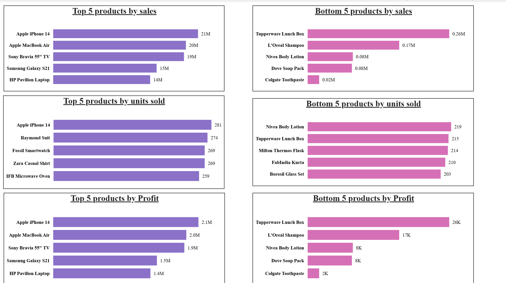
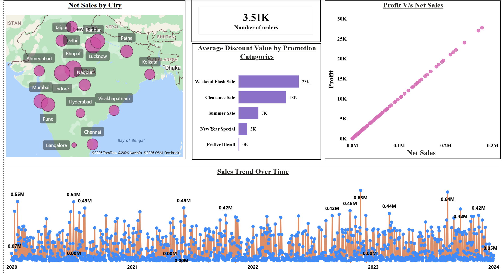
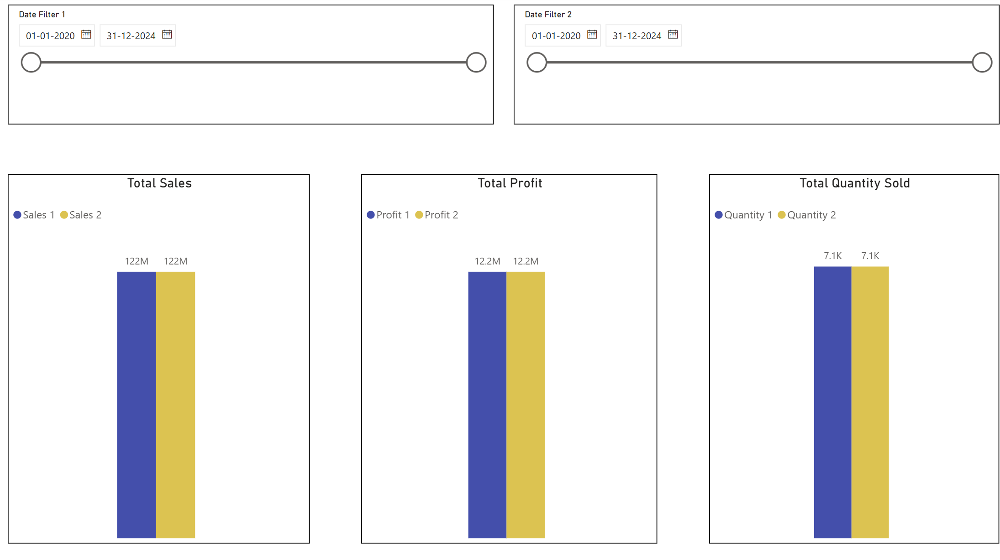
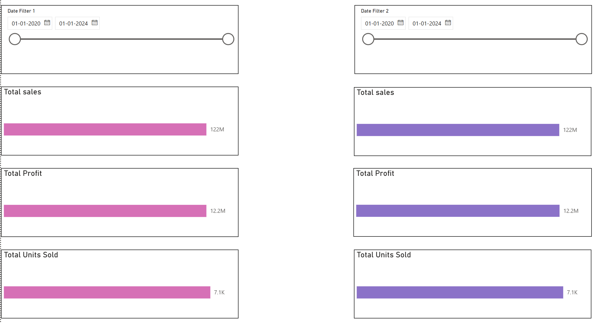
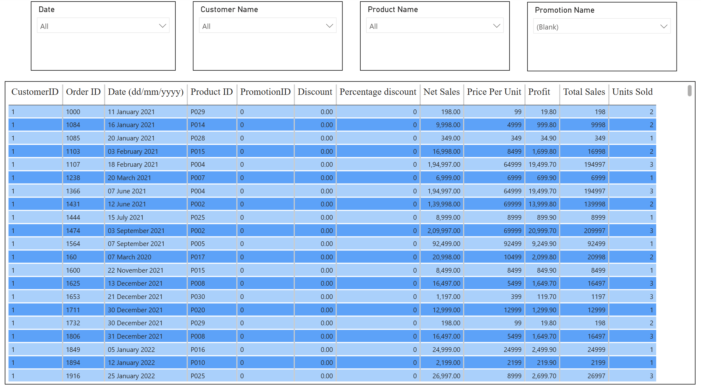

#     Sales Data Analysis

## Problem Statement

This dashboard helps businesses analyze their sales performance and profitability through an interactive view of Sales, Profit, Units Sold, Orders, product performance, promotion effectiveness, and geographical sales distribution.

It enables users to identify high- and low-performing products, analyze sales across different cities, evaluate promotion discounts, and compare Sales, Profit, and Units Sold between two selected periods.

The objective is to provide a centralized and interactive dashboard that helps businesses identify areas of strong and weak performance and make data-driven decisions.

### Steps followed

- Step 1 : Load data into Power BI Desktop, dataset is a csv file.

- Step 2 : Open power query editor & in view tab under Data preview section, check "column distribution", "column quality" & "column profile" options.

- Step 3 : Also since by default, profile will be opened only for 1000 rows so you need to select "column profiling based on entire dataset".

- Step 4 : In Power Query Editor, checked the Product ID column using column profiling. It contains 30 distinct and 30 unique values, with no null or error values, indicating that it can be used as a unique identifier for products.

- Step 5 : In the Dim Promotion table, promoted the first row to headers using "Use First Row as Headers". The Price Reduction Type column contained promotional values such as 20% Off, 10% Off and Buy One Get One.

- Step 6 : Created a new Percentage column using conditional rules based on Promotion ID to convert the promotional values into numerical values, such as 20% Off → 20, 10% Off → 10 and Buy One Get One → 50. Changed the data type of the Percentage column to numerical for further analysis.

- Step 7 : Applied a Left Outer Join between the Fact table and Dim Product table using Product ID as the common column to populate the missing Price per Unit values in the Fact Sales table.

- Step 8 : Expanded the merged Dim Product column and selected only the Price per Unit column to bring the corresponding product prices into the Fact Sales table. Removed the existing Price per Unit column containing null values and renamed the newly added column as Price per Unit.

- Step 9 : Reordered the Price per Unit column next to the Units Sold column for better organization and readability.

- Step 10 : Created a new Total Sales column using a custom column by multiplying Units Sold by Price per Unit. Changed its data type to whole number and removed the existing null values from the Total Sales column.

- Step 11 : Applied a Left Outer Join between the Fact table and Dim Promotion table using Promotion ID as the common column to bring the corresponding Percentage values into the Fact table.

- Step 12 : Expanded the merged Dim Promotion column and selected only the Percentage column. Renamed it as Percentage Discount and replaced the null values with 0, as null values represented transactions where no discount was given.

- Step 13 : Verified the data quality of the Percentage Discount column using Column Quality, confirming that there were no empty values. Removed the original Discount Percentage column containing null values, changed the data type of Percentage Discount to whole number, and reordered the column for better organization.

- Step 14 : Created a new Discount Value column using a custom column by multiplying Total Sales by Percentage Discount and dividing the result by 100. Removed the existing Discount Value column containing null values and changed the data type of the new Discount Value column to decimal number.

- Step 15 : Created a new Net Sales column by subtracting Discount Value from Total Sales. Changed the data type of the Net Sales column to decimal number to support further calculations and reporting.

- Step 16 : After completing the required data transformations and cleaning, selected Apply and Close to apply the changes and proceed to the Power BI report view for further analysis and visualization.

### Data Model Overview

- Step 17 : Opened the Model View in Power BI to review the relationships between the Fact table and the dimension tables and to establish a suitable star schema.

- Step 18 : Verified that the columns used for creating relationships had matching data types in the respective tables. Ensured that the required data cleaning and type transformations were completed before establishing the relationships.

- Step 19 : Created a One-to-Many (1:*) relationship between the Dimension Customer and Fact table using Customer ID. Dimension Customer is on the "one" side, while the Fact table is on the "many" side. Set the Cross-filter direction to Single so that filters flow from Dimension Customer to the Fact table.

- Step 20 : Created a One-to-Many (1:*) relationship between the Dimension Product and Fact table using Product ID, with Dimension Product on the "one" side and the Fact table on the "many" side. Set the Cross-filter direction to Single.

- Step 21 : Created a One-to-Many (1:*) relationship between the Dimension Promotion and Fact table using Promotion ID, with Dimension Promotion on the "one" side and the Fact table on the "many" side. Set the Cross-filter direction to Single.

- Step 22 : Established the primary and foreign key structure for the model. Product ID, Customer ID, and Promotion ID act as primary keys in their respective dimension tables and as foreign keys in the Fact table.

- Step 23 : Verified the final model structure, with the Fact table at the center and the Dimension Customer, Dimension Product, and Dimension Promotion tables connected to it. This forms a Star Schema, allowing dimension tables to filter the transactional data in the Fact table efficiently.

#### Requirement 1: Top & Bottom 5 Products by Sales, Quantity and Profit

- Step 24 : Added a Profit column to the Fact table, assuming Profit to be 10% of Net Sales. The formula used was `Profit = Net Sales × 10%`.

- Step 25 : Created six bar chart visuals to identify the Top 5 and Bottom 5 products based on Net Sales, Units Sold, and Profit using Top N and Bottom N filters.

- Step 26 : Formatted and arranged the visuals to provide a comparative view of the highest and lowest performing products across Sales, Quantity Sold, and Profit.

### Requirement 2: Sales Trend Over Time

- Step 27 : Created a line chart to analyze the sales trend over time, using Date from the Date table on the X-axis and Net Sales on the Y-axis.

- Step 28 : Used the Date hierarchy to drill between Year, Quarter, Month, and Date levels, allowing sales trends to be analyzed at different time granularities.

- Step 29 : Formatted the visual with an appropriate title, axis labels, and drill-down functionality to enable detailed time-based analysis.

### Requirement 3: Relationship Between Sales and Profit

- Step 30 : Created a scatter chart to analyze the relationship between Net Sales and Profit, using Net Sales on the X-axis and Profit on the Y-axis.

- Step 31 : Changed the aggregation to "Do not summarize" to represent individual data points instead of displaying only the overall sum of Sales and Profit.

- Step 32 : Observed a strong linear relationship between Sales and Profit, which is expected because Profit was calculated as 10% of Net Sales based on the project assumption.

### Requirement 5: Average Discount Offered in Each Discount Category

- Step 33 : Created a stacked bar chart to analyze the average discount offered across different promotion categories, using Promotion Name from the Dim Promotion table and the average of Discount Value from the Fact table.

- Step 34 : Removed the blank Promotion Name category from the visual because transactions with Promotion ID = 0 represent orders where no discount was given. Since Promotion ID 0 does not exist in the Dim Promotion table, the corresponding Promotion Name appears as blank after the relationship. These transactions therefore do not belong to any specific promotion category and were excluded from the visual.

- Step 35 : Formatted the visual and renamed it as "Average Discount by Promotion Category" for clear interpretation.

### Requirement 8: Sales by Different Cities

- Step 36 : Created an Azure Maps visual to analyze sales across different cities, using City from the Dim Customer table as the geographical location and Net Sales as the bubble size.

- Step 37 : Set the data category of the City column to "City" so that Power BI could correctly recognize and plot the geographical locations.

- Step 38 : Configured Net Sales as the bubble size, allowing cities with higher sales to be represented by larger bubbles. The visual was formatted to display the city and corresponding sales information on hover.

### Requirement 6: Total Number of Orders

- Step 39 : Added an Index column starting from 1 to uniquely identify each transaction record in the Fact table, as the dataset did not contain a dedicated Order ID column.

- Step 40 : Renamed the Index column as Order ID and changed its data type to text, since it was being used as an identifier rather than for mathematical calculations.

- Step 41 : Created a Card visual to display the Total Number of Orders by using a distinct count of Order ID.

### Requirement 4: Compare Sales, Profit, and Quantity Sold Between Two Selected Periods

> Note: An initial approach using two separate date tables and inactive relationships was explored. However, the approach was not preferred because it increased model complexity and required additional DAX measures. The final implementation uses Edit Interactions to achieve the same requirement more efficiently.

#### Approach 1: Using Two Date Tables
- Step 42 : Created two separate date tables using the `CALENDARAUTO()` function to allow users to select and compare two different date periods independently.

- Step 43 : Changed the data type of the Date column in both Date Table 1 and Date Table 2 to Date so that they match the Date column in the Fact Table.

- Step 44 : Created a one-to-many relationship between Date Table 1 and the Fact Table with single cross-filter direction and kept the relationship active.

- Step 45 : Created a one-to-many relationship between Date Table 2 and the Fact Table with single cross-filter direction and kept the relationship inactive to avoid ambiguity between multiple date-filtering paths.

- Step 46 : Added two date slicers to the report page using Date Table 1 and Date Table 2 and renamed them as Date Filter 1 and Date Filter 2.

- Step 47 : Created a clustered column chart using Net Sales to compare sales for the two selected date periods.

- Step 48 : Observed that Date Filter 1 changes the first sales value, while Date Filter 2 does not affect the second value because its relationship with the Fact Table is inactive.

- Step 49 : Created a DAX measure using `CALCULATE()`, `ALL()`, and `USERELATIONSHIP()` to activate the inactive relationship between Date Table 2 and the Fact Table when calculating the second period's sales.

- Step 50 : Used `ALL(Date Table 1)` in the measure to remove the filtering effect of Date Table 1, allowing Date Filter 2 to independently control the second sales value.

- Step 51 : Compared the two sales values using the clustered column chart, where the first column represents Date Filter 1 and the second column represents Date Filter 2.

- Step 52 : Created similar measures for Total Profit and Total Quantity Sold using the same `CALCULATE()`, `ALL()`, and `USERELATIONSHIP()` approach.

- Step 53 : Created separate clustered column charts for Total Profit and Total Quantity Sold to compare the two selected periods.

- Step 54 : Applied consistent formatting and colors across all three comparison visuals, with blue representing the first selected period and yellow representing the second selected period.

- Step 55 : The final comparison page allows users to independently select two date periods and compare Total Sales, Total Profit, and Total Quantity Sold side by side.

#### Approach 2: Edit Interactions — Recommended Approach

- Step 56 : Created a new report page named "Requirement 4: Edit Interactions" to implement the recommended approach for comparing two selected periods.

- Step 57 : Added a date slicer using the Date field from the Fact Table and renamed it as Date Filter 1.

- Step 58 : Added a second date slicer using the Date field from the Fact Table and renamed it as Date Filter 2. Added borders to both slicers for better visual separation.

- Step 59 : Created three bar charts to represent Total Sales, Total Profit, and Total Quantity Sold.

- Step 60 : Duplicated the three bar charts to create a second set for comparison and placed the two sets side by side.

- Step 61 : Applied different colors to distinguish the values controlled by Date Filter 1 from the values controlled by Date Filter 2.

- Step 62 : Selected Date Filter 1 and used the "Edit Interactions" option to control how the slicer affects each visual.

- Step 63 : Set the interaction to "Filter" for the left-side charts so that their values change according to the selection made in Date Filter 1.

- Step 64 : Set the interaction to "None" for the right-side charts so that they remain unchanged when Date Filter 1 is used.

- Step 65 : Repeated the same Edit Interactions configuration for Date Filter 2, allowing it to affect only the right-side charts while keeping the left-side charts unchanged.

- Step 66 : In this way, the two sets of charts respond independently to their respective date filters, allowing comparison of Total Sales, Total Profit, and Total Quantity Sold between two selected periods.

- #### This approach was preferred over creating separate date tables and additional DAX measures because it fulfills the requirement without increasing the data model size or adding unnecessary complexity.

### Requirement 7: Display Order-Level Details Using a Table Visual

- Step 67 : Created a new report page to display the underlying sales data in a tabular format.

- Step 68 : Added slicers for Date, Customer Name, Product Name, and Promotion Name to allow users to filter the table interactively.

- Step 69 : Added a Table visual and included Customer ID, Order ID, Date, Product ID, Promotion ID, Discount, Percentage Discount, Net Sales, Price Per Unit, Profit, Total Sales, and Units Sold.

- Step 70 : Formatted the Date field to display dates in the `dd/mm/yyyy` format for better readability.

- Step 71 : Applied formatting to the table visual to improve readability and provide a clear view of the transaction-level data.

- Step 72 : Enabled interactive filtering through the slicers so that users can view specific transactions based on the selected Date, Customer Name, Product Name, or Promotion Name.

- Step 73 : Selected the dimension-based slicers and aligned them horizontally using the Align and Distribute Horizontally options.

- Step 74 : Created two additional slicers using Customer Name from the Customer dimension table and Promotion Name from the Promotion dimension table to test dynamic interaction between dimension slicers.

- Step 75 : Observed that selecting a value in one dimension slicer did not automatically filter the other dimension slicer because the relationships between the dimension tables and the Fact Table use a single-direction filter flow from dimension tables to the Fact Table.

- Step 76 : Created a `Sum DIM` measure in the Promotion dimension table to calculate Net Sales from the Fact Table.

- Step 77 : Added the `Sum DIM` measure to the visual-level Filters pane of the Promotion Name slicer and configured it to show items when the measure value is not blank.

- Step 78 : Applied the same `Sum DIM` visual-level filter to the Customer Name slicer so that only dimension values having corresponding transactions are displayed.

- Step 79 : Tested the slicers by selecting a Customer Name and observed that the Promotion Name slicer dynamically displayed only the promotion categories associated with the selected customer.

- Step 80 : Applied the same visual-level filtering technique to the remaining dimension-based slicers on the Table Visual page.

- Step 81 : Tested the final slicers to ensure that selections in one dimension slicer dynamically filter the available values in the other dimension slicers.

- Step 82 : The report was then published to Power BI Service.

# Insights

The Power BI dashboard provides an interactive analysis of sales, profit, 
units sold, product performance, promotion discounts, geographical sales, 
and order-level details.

Following insights can be drawn from the dashboard;

### [1] Overall Sales Performance

- Total number of orders = 3.51K.
- The Sales Trend Over Time shows fluctuations in sales between 2020 and 2024.
- The highest visible sales value in the trend is approximately 0.65M.

Thus, sales performance varies over time, with certain periods showing significantly higher sales.

### [2] Top Performing Products by Sales

- Apple iPhone 14 generated the highest sales = 21M.
- Apple MacBook Air generated sales = 20M.
- Sony Bravia 55" TV generated sales = 19M.
- Samsung Galaxy S21 generated sales = 15M.
- HP Pavilion Laptop generated sales = 14M.

Thus, Apple iPhone 14 is the highest-selling product among the displayed top 5 products.

### [3] Bottom Performing Products by Sales

- Tupperware Lunch Box generated sales = 0.26M.
- L'Oreal Shampoo generated sales = 0.17M.
- Nivea Body Lotion generated sales = 0.08M.
- Dove Soap Pack generated sales = 0.08M.
- Colgate Toothpaste generated sales = 0.02M.

Thus, these products have considerably lower sales compared with the top-performing products.

### [4] Product Performance by Units Sold

- Apple iPhone 14 has the highest units sold among the displayed top 5 products = 281.
- Raymond Suit = 274 units.
- Fossil Smartwatch = 269 units.
- Zara Casual Shirt = 269 units.
- IFB Microwave Oven = 259 units.

Among the displayed bottom 5 products by units sold:
- Nivea Body Lotion = 219 units.
- Tupperware Lunch Box = 215 units.
- Milton Thermos Flask = 214 units.
- FabIndia Kurta = 210 units.
- Borosil Glass Set = 203 units.

Thus, product rankings vary depending on whether performance is measured by sales value or units sold.

### [5] Profitability Analysis

- Apple iPhone 14 generated the highest profit = 2.1M.
- Apple MacBook Air generated profit = 2.0M.
- Sony Bravia 55" TV generated profit = 1.9M.
- Samsung Galaxy S21 generated profit = 1.5M.
- HP Pavilion Laptop generated profit = 1.4M.

Among the displayed bottom 5 products by profit:
- Tupperware Lunch Box = 26K.
- L'Oreal Shampoo = 17K.
- Nivea Body Lotion = 8K.
- Dove Soap Pack = 8K.
- Colgate Toothpaste = 2K.

Thus, the products appearing among the top performers by sales also show higher profit values in the displayed analysis.

### [6] Promotion Analysis

- Weekend Flash Sale has the highest displayed average discount = 23K.
- Clearance Sale = 18K.
- Summer Sale = 7K.
- New Year Special = 3K.
- Festive Diwali = 0K.

Thus, Weekend Flash Sale has the highest average discount among the displayed promotion categories.

### [7] Geographical Sales Analysis

- The Net Sales by City visual shows sales distribution across multiple cities.
- Cities such as Delhi, Mumbai, Nagpur, Pune, Hyderabad, Ahmedabad, Kolkata, and other cities are represented in the geographical analysis.

Thus, the map visual provides a city-level view of net sales and helps identify geographical differences in sales performance.

### [8] Relationship Between Profit and Net Sales

- The Profit Vs Net Sales visual indicates a positive relationship between profit and net sales.
- Higher net sales values are generally associated with higher profit values in the visual.

Thus, the analysis indicates that higher net sales are generally accompanied by higher profit.

### [9] Period Comparison

- The Comparison Sales/Profit/Quantity page allows users to select two different date ranges.
- Sales, Profit, and Units Sold can be compared independently for the two selected periods.

Thus, the dashboard can be used to evaluate changes in sales performance, profitability, and units sold between any two user-selected periods.

### [10] Interactive Order-Level Analysis

- The Table Visual provides order-level information such as Customer ID, Order ID, Date, Product ID, Promotion ID, Discount, Percentage Discount, Net Sales, Price Per Unit, Profit, Total Sales, and Units Sold.
- Users can filter the order-level data using Date, Customer Name, Product Name, and Promotion Name.
- Dimension-based slicers dynamically filter the available values in other slicers.

Thus, users can move from high-level dashboard analysis to detailed order-level information using interactive filters.